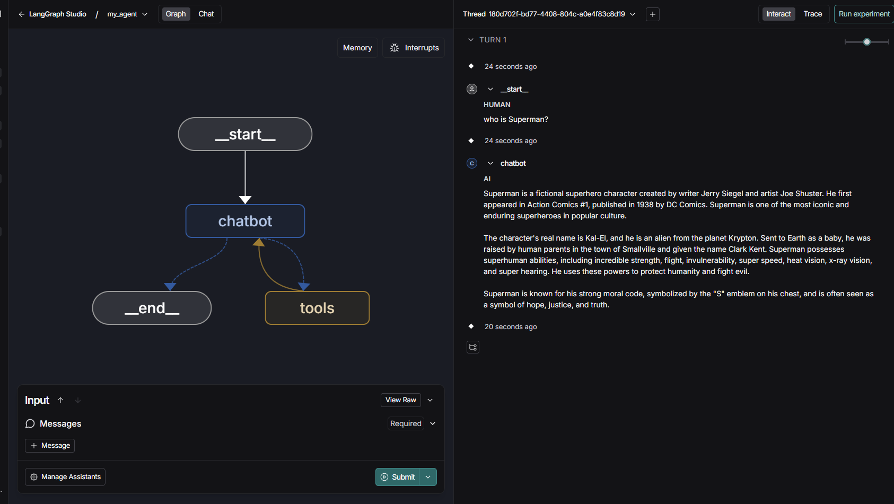

# langgraph_app_with_langgraph_studio

A sample project demonstrating a LangGraph agent with OpenAI and Tavily tools.

## Features

- Uses [LangGraph](https://github.com/langchain-ai/langgraph) for agent orchestration.
- Integrates OpenAI chat models via `langchain-openai`.
- Adds Tavily search as a tool via `langchain-tavily`.
- Loads environment variables from `.env`.
- Generates a Mermaid diagram of the agent graph.

## Setup

1. **Clone the repository:**
   ```sh
   git clone <your-repo-url>
   cd langgraph_app_with_langgraph_studio
   ```

2. **Install dependencies:**
   ```sh
   pip install -r requirements.txt
   ```
   Or use [uv](https://github.com/astral-sh/uv) for faster installs:
   ```sh
   uv pip install -r requirements.txt
   ```

3. **Set up environment variables:**
   - Create a `.env` file in the root directory with your OpenAI and Tavily credentials:
     ```
     OPENAI_KEY=your-openai-api-key
     OPENAI_MODEL=gpt-4.1-mini
     ```

## Running LangGraph Studio

To run and test the application using LangGraph Studio, use the following command:

```sh
uv langgraph studio
```

This will launch LangGraph Studio, which will automatically detect your `langgraph.json` and load the agent for interactive testing.

### Example

Below is a screenshot of the agent running in LangGraph Studio:



> The interface shows the agent graph on the left and the chat interaction on the right.

---


## Project Structure

```
langgraph_app_with_langgraph_studio/
├── chatbot_agent/
│   └── agent.py
├── langgraph.json
├── requirements.txt
├── README.md
└── .env
```

## License

This project is licensed under the MIT License - see the [LICENSE](LICENSE) file for details.